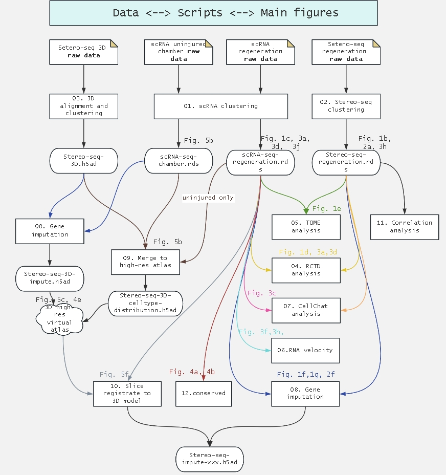

# ZebrafishHeartRegeneration_project

## Brief
All scripts for paper "An Organ-wide Spatiotemporal Transcriptomic and Cellular Atlas of the Regenerating Zebrafish Heart".

## Data avaliable

All sequencing data stored in CNGB https://db.cngb.org/search/project/CNP0005245/.

Additional stereo-seq raw GEM and tif files stored in STOmicsDB https://db.cngb.org/stomics/project/STT0000071/spatialGeneExpression.

All processed rds and h5ad files also stored in STOmicsDB https://db.cngb.org/stomics/zebrafish_VRH/download/

Interactive data browser in https://db.cngb.org/stomics/zebrafish_VRH/ and 3D data browser in https://www.bgiocean.com/zebrafish_VRH/. Specially, the high-res scRNA & ST virtual atlas only in 3D browser: https://www.bgiocean.com/zebrafish_VRH/heart3d_merge/index.html?atlas=/zebrafish_VRH/heart3d_merge/.

## The full workflow of this paper

